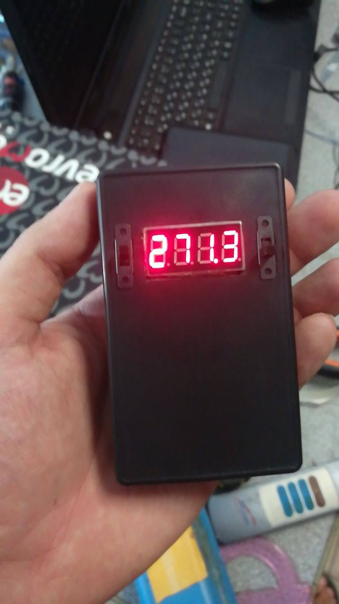
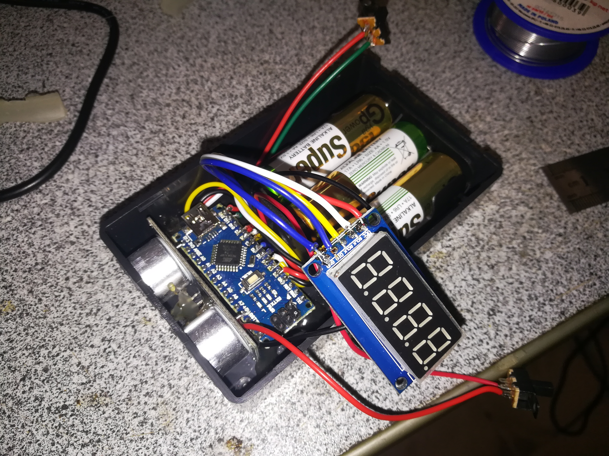

# Arduino Ultrasonic Distance Meter

**Description:** A simple and accurate ultrasonic distance meter built with Arduino Nano and HC-SR04 sensor. Measures distance with up to 1 mm accuracy and displays the result on a 7-segment display with a decimal point. Powered by 3 AA batteries.

## Contents

- [Project Overview](#project-overview)
- [Technical Specifications](#technical-specifications)
- [Wiring Diagram](#wiring-diagram)
- [Assembly and Firmware](#assembly-and-firmware)
- [Operation and Features](#operation-and-features)

---

## Project Overview

This project is an ultrasonic distance meter using Arduino Nano and HC-SR04. It features a 7-segment display with a TM74HC59 driver to show distance with a decimal point. Measurements are filtered with two filters to achieve ~1 mm accuracy. A switch allows shifting the zero point to the opposite end of the device. The device is powered by 3 AA batteries.

---

## Technical Specifications

- **Platform:** Arduino Nano (ATmega328)  
- **Distance Sensor:** HC-SR04  
- **Display:** 7-segment display with TM74HC59 driver  
- **Power:** 3 AA batteries  
- **Measurement Accuracy:** ~1 mm  
- **Filtering:** 2-stage filtering for improved accuracy  
- **Switch:** Shifts zero point to opposite end  

---

## Wiring Diagram

---

## Assembly and Firmware

1. Assemble the circuit according to the wiring diagram.  
2. Open Arduino IDE and create a new sketch.  
3. Copy the source code from the repository into the editor.  
4. Select the correct board and COM port under **Tools**.  
5. Upload the sketch to Arduino Nano.  

---

## Operation and Features

- Turn on the device using the left switch.  
- The ultrasonic sensor has a wide detection beam; at 4 meters, the measurement area is about 4 meters wide.  
- The flatter the object surface, the more accurate the readings.  
- The right switch allows shifting the zero point to the opposite end of the device.  

---

This project is a great example of using Arduino for practical DIY devices. Suitable for both beginners and experienced makers who want to build their own ultrasonic distance meter.
